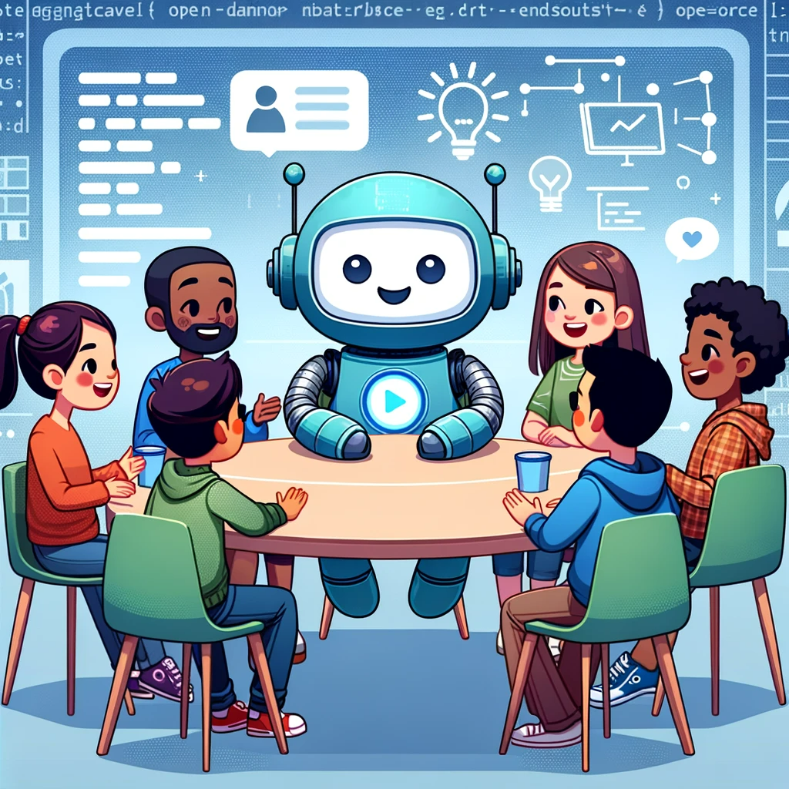

Welcome to our open-source project, where we are pioneering a new approach to enhancing the reliability and credibility of responses provided by Large Language Models (LLMs). Our project is rooted in a simple yet powerful idea: ensuring that every response is not only intelligent but also grounded in reality.

## The Challenge

The rise of LLMs has revolutionized the way we interact with AI, offering impressive capabilities in generating human-like text. However, one persistent challenge remains – ensuring the accuracy and honesty of the information provided. Traditional models often lack the ability to discern and convey truths, occasionally leading to responses based on misconceptions or incomplete data.

## Our Solution

Our open-source project addresses this challenge head-on. Here's how it works:

1. **Keyword Extraction**: When a user poses a question, our system employs advanced techniques to extract the key themes and topics.

2. **Document Retrieval**: Leveraging these keywords, the system then searches through a vast repository of verified and credible documents. This ensures that the foundation of every response is rooted in accurate information.

3. **Intelligent Response Generation**: The LLM then uses this information to craft a response. By basing answers on sourced documents, we substantially increase the reliability and veracity of each reply.

## The Impact

Our approach brings a new level of integrity to interactions with AI. By ensuring that each response is not just a product of artificial intelligence but also of real-world information, we are setting a new standard for trust in AI c

